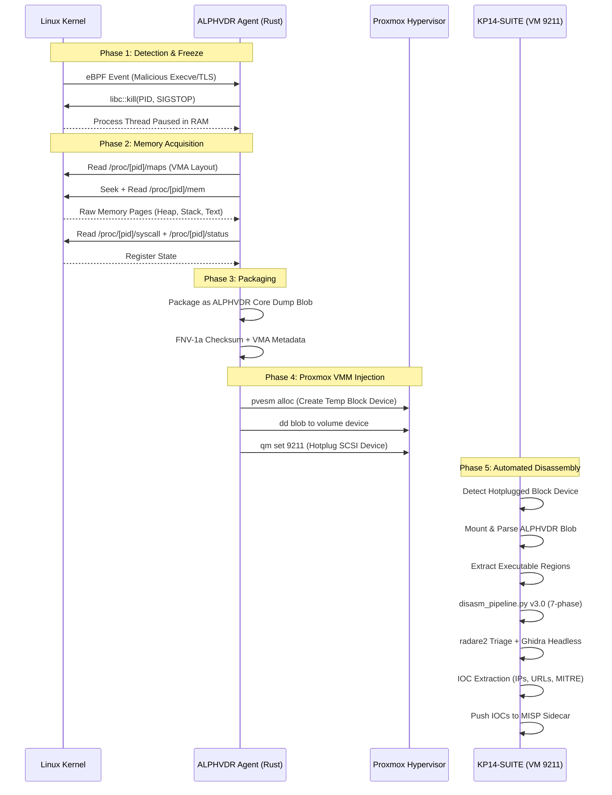

# Architecture: Live Memory Carving & Proxmox Routing

## Status: FULLY IMPLEMENTED

All five phases of the memory carving and disassembly pipeline are implemented in Rust. This document describes the architecture and the corresponding source modules.

The ALPHVDR EDR bridges the gap between a frozen malicious process on an endpoint and an isolated Proxmox disassembly suite (`KP14-SUITE`, VMID 9211, hostname `kp14-suite` at 192.168.1.252).

## 1. Architectural Workflow



## 2. Implementation Modules

### Phase 1: The Freeze (`SIGSTOP`)
**Module:** `src/main.rs` (Responder Engine)

When a high-severity threat is detected (YARA match, honeytoken breach, heuristic trigger, or ransomware signature), the responder engine issues `libc::kill(pid, SIGSTOP)` via the async mpsc channel. This halts the process scheduler from allocating CPU time to the malicious thread. The malware's memory — including decrypted payloads, encryption keys, and C2 configurations — remains perfectly preserved in RAM.

**Trigger sources:**
- YARA in-memory signature match (shellcode, C2 beacons, ransomware markers, io_uring evasion)
- Shannon entropy > 7.5 bits/byte (packed/encrypted payload detection)
- Honeytoken inode breach (eBPF `vfs_open` hook)
- Heuristic: `/tmp/` or `/dev/shm/` execution, root shell spawn
- Ransomware: `.enc` file extension or `ransomware` comm

### Phase 2: Virtual Memory Area (VMA) Carving
**Module:** `src/memory_carver.rs` — `MemoryCarver` struct

The `MemoryCarver` struct implements full VMA extraction:

1. **VMA Layout Parsing** (`parse_vma_layout()`): Reads and parses `/proc/[pid]/maps` to build a `Vec<VmaEntry>`. Each entry contains start/end addresses, permissions (r/w/x), offset, device, inode, and pathname. Classifies regions as heap (`[heap]`), stack (`[stack]`), anonymous (no pathname), or mapped files.

2. **Memory Page Extraction** (`carve_memory()`): Opens `/proc/[pid]/mem` and performs seek-based reads (`SeekFrom::Start(vma.start)`) for each readable VMA region. Caps individual region reads at 64MB to prevent OOM. Skips non-readable regions (`---p` guard pages) and special device-mapped regions (`[vvar]`, `[vsyscall]`).

3. **Register State Capture** (`capture_register_state()`): Reads `/proc/[pid]/syscall` (raw syscall number + register values) and `/proc/[pid]/status` (process state, memory maps, credentials) for forensic context.

**Key types:**
- `VmaEntry` — parsed VMA with classification helpers (`is_executable()`, `is_heap()`, `is_stack()`, `is_anonymous()`)
- `MemoryCarver` — the carver instance, parameterized by PID

### Phase 3: Core Dump Blob Packaging
**Module:** `src/memory_carver.rs` — `package_core_dump()` + `carve_and_package()`

Carved memory, VMA metadata, and register states are synthesized into a proprietary `ALPHVDR` core dump blob format:

**Blob format:**
```
[CoreDumpHeader]
  magic: "ALPHVDR\0" (8 bytes)
  version: u32
  pid: i32
  timestamp: u64 (Unix epoch)
  vma_count: u32
  total_payload_size: u64
  checksum: u32 (FNV-1a over all carved data)

[Register State Section]
  length: u64 (LE)
  data: bytes (syscall + status content)

[For each VMA:]
  [CoreDumpVmaRecord]
    start: u64, end: u64
    perms_flags: u8 (bit 0: read, bit 1: write, bit 2: exec)
    offset: u64
    data_len: u64
  [pathname_len: u16 (LE)]
  [pathname: bytes]
  [memory_data: bytes]
```

**Integrity:** FNV-1a checksum computed over all carved memory pages for tamper detection.

**Output:** Written to `/tmp/alphvdr/carved/core_dump_{pid}_{timestamp}.bin`

### Phase 4: The Proxmox Bridge
**Module:** `src/proxmox_bridge.rs` — `ProxmoxBridge` struct

Routes the core dump blob from the endpoint to the KP14-SUITE VM via the Proxmox hypervisor:

1. **Storage Allocation** (`allocate_storage()`): Executes `pvesm alloc <storage> <volume_name> <size>M` to create a temporary logical volume. Volume named `alphvdr-coredump-{timestamp}`. Storage size calculated as blob size + 10% overhead.

2. **Blob Write** (`write_blob_to_volume()`): Resolves the volume device path via `pvesm path`, then writes the blob using `dd if=blob of=device bs=1M conv=fdatasync`. In remote mode, uses `scp` over the management interface.

3. **VM Hotplug** (`hotplug_to_vm()`): Scans `qm config 9211` for used SCSI slots, finds first available slot (10-30 range, lower slots reserved for OS disks), then executes `qm set 9211 --scsi{slot},{volume_id}`.

4. **Cleanup** (`cleanup_volume()`): After analysis (5-minute delay), removes the hotplugged device (`qm set 9211 --delete scsi{slot}`) and frees the volume (`pvesm free {volume_id}`).

**Modes:**
- **Local hypervisor** (`is_local_hypervisor: true`): Direct `pvesm`/`qm` execution
- **Remote** (`is_local_hypervisor: false`): SSH/API routing over isolated management VLAN

**Default config:** `ProxmoxBridge::default_kp14()` -> storage: `local-lvm`, VMID: `9211`, host: `localhost:8006`

### Phase 5: Disassembly (`KP14-SUITE`)
**Module:** `src/kp14_suite.rs` — `Kp14Client` struct + `ParsedCoreDump` struct

Integrates with the real KP14 platform running on `kp14-suite` (192.168.1.252, SSH alias `kp14`). The KP14 VM runs Debian 13 (kernel 6.12.94) with Ghidra 12.0.4, radare2/rizin, binwalk, sleuthkit, bulk_extractor, capa, and the full KP14 RE pipeline.

**Pipeline:**

1. **Core Dump Parsing** (`ParsedCoreDump::from_file()`): Reads the ALPHVDR blob, validates magic, extracts header fields, register state, and all VMA records with their memory data. Handles packed struct alignment safely.

2. **Executable Region Extraction** (`extract_executable_regions()`): Writes each executable VMA (`perms_flags & 0x04`) as a standalone `.bin` file. Also produces a combined full dump for complete analysis.

3. **String Extraction** (`extract_strings()`): Quick IOC hunting — extracts ASCII strings (min 6 chars) from all memory regions for pattern matching.

4. **Disassembly Pipeline** (`run_disassembly_pipeline()`): Invokes the real `disasm_pipeline.py` v3.0 at `/home/debian/KP14/src/kp14/analysis/pipeline/disasm_pipeline.py`:
   - **Phase 1 — Triage:** Binary identification, entropy, packer detection, PE/ELF structure analysis
   - **Phase 2 — Decompilation:** Headless Ghidra + radare2 decompilation
   - **Phase 3 — Annotation:** Multi-engine function naming, API annotation, MITRE ATT&CK mapping
   - **Phase 4 — Reconstruction:** Compilable C generation with type recovery
   - **Phase 5 — Validation:** Syntax-only compile test, function coverage analysis
   - **Phase 6 — Hidden Data & Steganography:** Multi-format image analysis, PDF embedded object extraction, LSB steganography, entropy analysis
   - **Phase 7 — Packaging:** ZIP packaging with optional SSH/SFTP transfer

5. **Radare2 Quick Triage** (`run_radare2_triage()`): Runs `r2 -q -c 'aaa; afl; iI; iz; iC'` for fast function listing, string extraction, and metadata.

6. **Ghidra Headless** (`run_ghidra_headless()`): Invokes `/opt/ghidra/support/analyzeHeadless` for deep decompilation when needed.

7. **IOC Extraction** (`extract_iocs_from_output()`): Parses pipeline output files for:
   - IPv4 addresses (validated)
   - URLs (HTTP/HTTPS)
   - Linux file paths (`/usr/`, `/tmp/`, `/var/`, `/etc/`, `/home/`, `/opt/`, `/dev/`, `/proc/`, `/sys/`)
   - Domain names
   - MITRE ATT&CK technique IDs (from capa output, e.g., T1059, T1027)
   - Deduplicates all IOCs before forwarding

8. **MISP Push** (`push_iocs_to_misp()`): Writes extracted IOCs as JSON to `/tmp/alphvdr/extracted_iocs.json` for the MISP sidecar to ingest. Each IOC includes type, value, confidence score, and source.

9. **Cleanup** (`cleanup_mount()`): Unmounts the block device from `/mnt/alphvdr`.

**Operating modes:**
- **Daemon mode** (`run_daemon_pipeline()`): Runs on KP14-SUITE itself. Polls `/dev` for new block devices (sd*/vd*/nvme*), mounts them read-only at `/mnt/alphvdr`, locates the core dump blob, and runs the full analysis pipeline.
- **Remote SSH mode** (`run_remote_analysis()`): The EDR agent SCPs the blob to KP14-SUITE, then SSHes in to invoke `disasm_pipeline.py` remotely. Used as the primary mode from the endpoint agent, with fallback if Proxmox routing fails.

**KP14-SUITE environment:**
- Ghidra 12.0.4 at `/opt/ghidra/`
- Radare2 + rizin at `/usr/local/bin/`
- 10 backend adapters: Ghidra, RetDec, angr, radare2, rizin, cutter, capa, DIE, peframe, bulk_extractor
- Pipeline profiles: `triage`, `disasm`, `decompile`, `full`, `firmware`, `malware`, `auto`
- Config at `~/.kp14/config.json` with Kaplan/Tor integration

## 3. YARA In-Memory Scanning Integration
**Module:** `src/yara.rs` — `YaraEngine` struct

The YARA engine now uses `MemoryCarver` to extract VMA regions and applies heuristic byte-pattern signatures:

**Built-in signatures (18 patterns):**
- **Shellcode:** x86 NOP sleds, `syscall(execve)` sequences, push/pop/dec patterns
- **C2 Beacons:** `POST /beacon`, `GET /checkin`, `GET /gate.php`
- **Crypto:** AES S-box partial, RC4 key markers
- **Reverse shells:** `/bin/sh`, `/bin/bash -i`
- **Ransomware:** `.encrypted` extension, `YOUR FILES ARE ENCRYPTED` note
- **Cryptominers:** `stratum+tcp://`, `monero`
- **Fileless malware:** `/tmp/.X11`, `/dev/shm/.`
- **io_uring evasion (GentlemenKiller-class):** `io_uring_setup`, `io_uring_enter`, `io_uring_queue_init`

**Entropy detection:** Shannon entropy > 7.5 bits/byte on regions > 1KB triggers packed/encrypted payload alert.

## 4. Responder Engine Integration
**Module:** `src/main.rs`

The async responder engine (`tokio::spawn`) now executes the full 5-phase pipeline after `SIGSTOP`:

1. `MemoryCarver::carve_and_package()` -> produces blob path
2. `ProxmoxBridge::route_to_kp14()` -> allocates volume, writes blob, hotplugs to VM 9211
3. `Kp14Client::run_remote_analysis()` -> SCPs blob, invokes `disasm_pipeline.py`, extracts IOCs
4. Prints all extracted IOCs with type, value, confidence, and source
5. Spawns delayed cleanup task (5 min) to unmount and free the Proxmox volume

**Fallback:** If Proxmox routing fails, falls back to direct SSH transfer to KP14-SUITE.

All blocking operations (memory carving, SSH, pipeline execution) run via `tokio::task::spawn_blocking` to avoid blocking the async event loop.

## 5. Source File Reference

| File | Phase | Description |
|---|---|---|
| `src/main.rs` | 1, 3-5 | Responder engine: SIGSTOP -> carve -> route -> analyze -> IOC extraction |
| `src/memory_carver.rs` | 2, 3 | VMA parsing, memory extraction, core dump blob packaging |
| `src/proxmox_bridge.rs` | 4 | pvesm alloc, dd write, qm set hotplug, cleanup |
| `src/kp14_suite.rs` | 5 | Blob parsing, executable extraction, disasm_pipeline.py, radare2, IOC extraction, MISP push |
| `src/yara.rs` | 1 (detection) | Memory carving + heuristic signatures + entropy analysis |
